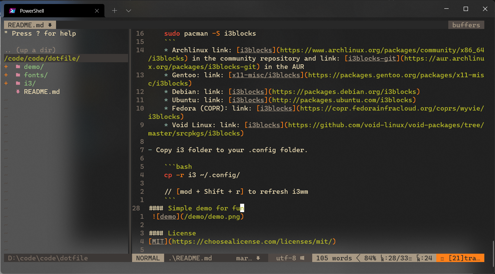
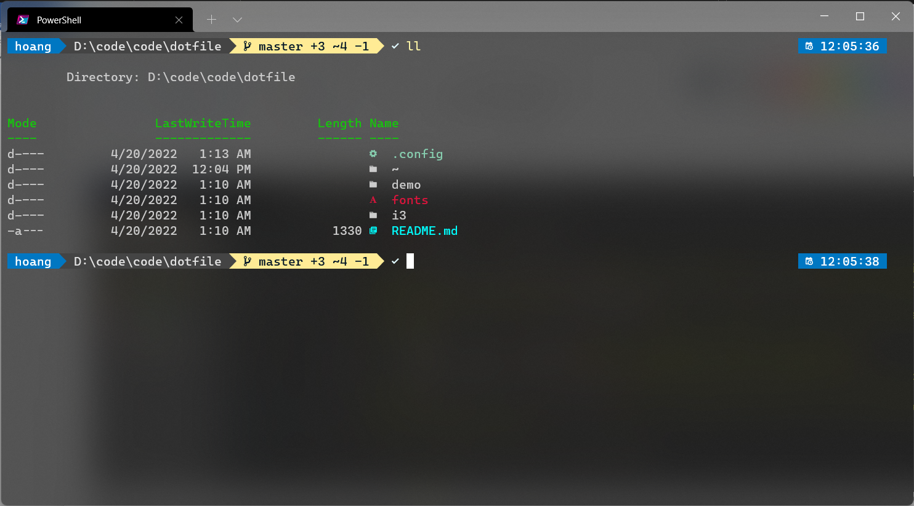

### i3config
#### My i3 windows manager config file. Enjoy!
#### For more information
- [i3-config](https://i3wm.org/docs/userguide.html)
- [Arch wiki](https://wiki.archlinux.org/index.php/i3)
- [i3blocks](https://github.com/vivien/i3blocks/)
- [i3lock](https://i3wm.org/i3lock/)
- [i3status](https://i3wm.org/docs/i3status.html)
#### Usage
- Install i3blocks
    ``` bash
    sudo pacman -S i3blocks
    ```
    * Archlinux link: [i3blocks](https://www.archlinux.org/packages/community/x86_64/i3blocks) in the community repository and link: [i3blocks-git](https://aur.archlinux.org/packages/i3blocks-git) in the AUR
    * Gentoo: link: [x11-misc/i3blocks](https://packages.gentoo.org/packages/x11-misc/i3blocks)
    * Debian: link: [i3blocks](https://packages.debian.org/i3blocks)
    * Ubuntu: link: [i3blocks](http://packages.ubuntu.com/i3blocks)
    * Fedora (COPR): link: [i3blocks](https://copr.fedorainfracloud.org/coprs/wyvie/i3blocks)
    * Void Linux: link: [i3blocks](https://github.com/void-linux/void-packages/tree/master/srcpkgs/i3blocks)

- Copy i3 folder to your .config folder. 

    ```bash
    cp -r i3 ~/.config/

    // [mod + Shift + r] to refresh i3wm 
    ```
#### Demo
 
 
 
#### License
[MIT](https://choosealicense.com/licenses/mit/)

